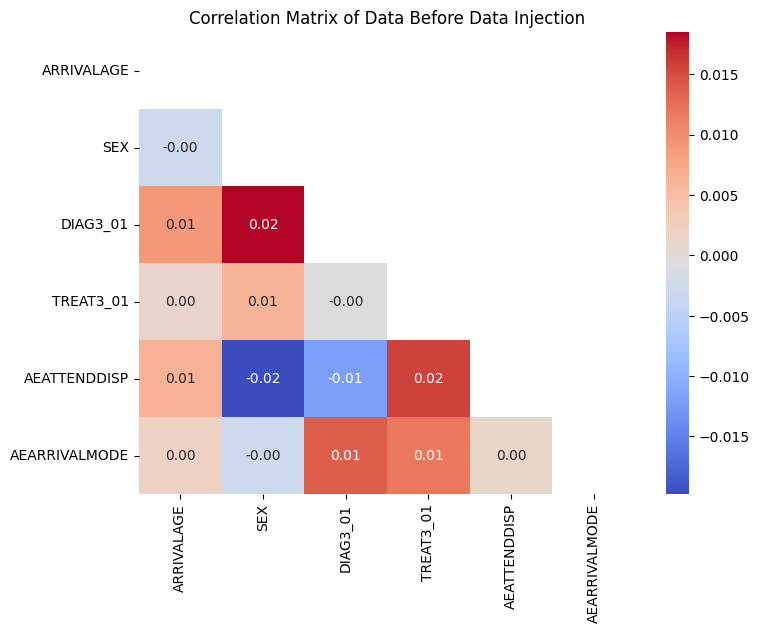
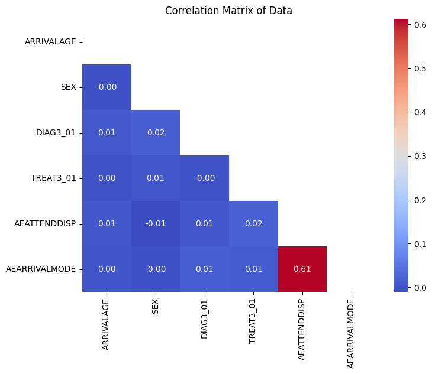

# Methodology

## Approach

* This project will use a rule-based data synthesis approach to address the limitations of the existing artificial HES data. 
* Rather than generating a new dataset from scratch, the approach is to add relationships to the existing 10,000-row artificial dataset.
* This provides a practical solution that fits within the project timeline and adheres to the requirement of not using real HES data.

## Input Data

* The project will use the existing, non-disclosive A&E 10,000-row artificial HES dataset created by NHS England.
* The dataset consists of 10,000 rows and 165 attributes.
* The dataset includes a variety of attributes related to emergency care.

## Key columns used in this project

* **AEATTENDDISP:** The patient’s discharge status.
* **AEARRIVALMODE:** How the patient arrived at the facility.
* **DIAG3_01:** The patient’s primary diagnosis.
* **SEX:** The patient’s gender.

# Process

The process for enhancing the artificial dataset followed these steps

## Initial Data Validation

The project began by generating a correlation matrix in Python to confirm the lack of meaningful linear relationships between numerical attributes. This step provided the clear justification for the data enhancement.

---

---

## Relationship Identification & Enhancement

Based on the requirements of the NHP demand model,  two key inter-column relationships were identified:  

* An Ambulance Rule: If AEARRIVALMODE is 1 (arrival by ambulance), then AEATTENDDISP is set to 1 (hospital bed).
* A Female Rule: If DIAG3_01 is 28 (Obstetric conditions) or 29 (Gynaecological conditions), then SEX is set to 2 (female).
* Using Python and the Pandas library, a script was developed to create realistic relationships in the artificial dataset.

## Output & Validation 

The final output will be an enhanced artificial HES dataset. The dataset was validated to confirm that the newly created relationships were present by generating a new correlation matrix.This confirms that the newly created relationships are present while also ensuring the data remains non-disclosive and suitable for the open-source NHP model.

---

## The Results

**Before:**

*The initial correlation matrix showed no meaningful relationships.
*This confirmed the need for data enhancement.

**After:**

*The new correlation matrix confirms that the rules successfully injected relationships.
*The correlation values for the target columns have significantly increased.